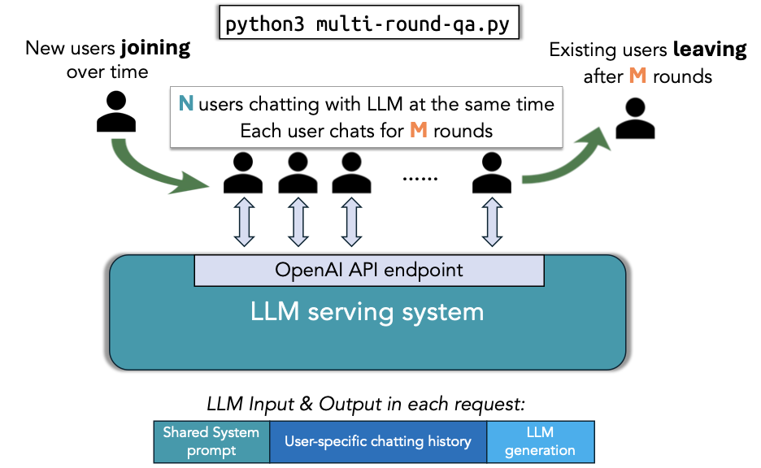

.. _multiround-qa:

Multi-round QA
==============

Benchmarking vLLM Production Stack Performance with multi-round QA

Overview
--------

This repository contains benchmarking tools for evaluating vLLM Production Stack's performance (e.g., latency, throughput). The initial focus of this benchmark is on the multi-round QA (Question Answering) use case. The script ``multi-round-qa.py`` simulates multiple users interacting with a language model concurrently for multiple rounds, allowing you to analyze the serving engine's throughput and latency.

The overall workflow of this script is shown below:

Setup
-----

Install the required packages needed to run the benchmark:

.. code-block:: bash

    pip install -r requirements.txt

Running benchmarks
------------------

To run the multi-round QA benchmark, use the following example command:

.. code-block:: python

    python3 multi-round-qa.py \
        --num-users 10 \
        --num-rounds 5 \
        --qps 0.5 \
        --shared-system-prompt 1000 \
        --user-history-prompt 2000 \
        --answer-len 100 \
        --model meta-llama/Llama-3.1-8B-Instruct \
        --base-url http://localhost:30080/v1

Use ``Ctrl-C`` to terminate the benchmark at any time, and the script will write each request's detailed stats to ``summary.csv``.

Note: The above command requires a serving engine with the ``meta-llama/Llama-3.1-8B-Instruct`` model served locally at ``http://localhost:30080/v1``. Here's an example command to launch the serving engine with vLLM Production Stack:

.. code-block:: bash

    helm repo add vllm https://vllm-project.github.io/production-stack
    helm install vllm vllm/vllm-stack -f model.yaml

Then, perform port-forwarding with the following command:

.. code-block:: bash

    sudo kubectl port-forward svc/vllm-router-service 30080:80

Explanation of the arguments
----------------------------

Configuring the workload
~~~~~~~~~~~~~~~~~~~~~~~~~

- ``--num-users <int>``: The maximum number of concurrent users in the system (N in the above figure).
- ``--num-rounds <int>``: The number of rounds per user (M in the above figure).
- ``--qps <float>``: The overall queries per second (QPS) rate for the system.
- ``--shared-system-prompt <int>``: Length of the system prompt shared across all users (in tokens).
- ``--user-history-prompt <int>``: Length of the user-specific context (simulating existing chat history) (in tokens).
- ``--answer-len <int>``: Length of the answer expected (in tokens).
- ``--init-user-id <int>``: The initial user ID to start the benchmark (default = 0). This is useful when you want to resume the benchmark from a specific user ID or avoid serving engine caching the request from previous runs.
- ``--request-with-user-id``: If this option is present, the script will include the user ID in the request header.
- ``--sharegpt``: If this option is present, the script will use ShareGPT workload instead of dummy context.

.. note::
    If you use the ShareGPT dataset, the length of the expected answer (in tokens) will be determined by the minimum value between the dataset response and ``--answer-len``. You also need to follow the instructions in **ShareGPT Datasets** first.

Configuring the serving engine connection
~~~~~~~~~~~~~~~~~~~~~~~~~~~~~~~~~~~~~~~~~

- ``--model <str>``: The model name (e.g., ``mistralai/Mistral-7B-Instruct-v0.2``).
- ``--base-url <str>``: The URL endpoint for the language model server.

Configuring the experiment (Optional)
~~~~~~~~~~~~~~~~~~~~~~~~~~~~~~~~~~~~~~

- ``--output <str>``: The CSV file to dump the detailed stats for each query (default = ``summary.csv``).
- ``--log-interval <float>``: Time between each performance summary log in seconds (default = 30).
- ``--time <float>``: Total time to run the experiment (default = forever).

Processing previous outputs only (Optional)
~~~~~~~~~~~~~~~~~~~~~~~~~~~~~~~~~~~~~~~~~~~

- ``--process-summary <filename>``: If this option is present, the script will only process the existing output CSV and print out the summary without running any experiment.

Benchmark Metrics
-----------------

- **Queries Per Second (QPS)**: The average number of queries processed by the model per second.
- **Average Prompt Throughput**: Tokens generated in the prompt per second.
- **Average Generation Throughput**: Tokens generated as part of the response per second.
- **Average TTFT (Time to First Token)**: Average time taken for the model to generate the first token of a response.

ShareGPT Datasets
-----------------

1. Download and prepare the ShareGPT dataset.
   You can specify the proportion of data to process by providing a number between 0 and 1 as an argument to the script.

   .. code-block:: bash

       bash prepare_sharegpt_data.sh 1

   In this example, ``1`` indicates processing 100% of the dataset. You can adjust this value as needed.

2. Run the benchmark.
   Example:

   .. code-block:: python

       python3 multi-round-qa.py \
           --num-users 10 \
           --num-rounds 5 \
           --qps 0.3 \
           --shared-system-prompt 1000 \
           --user-history-prompt 2000 \
           --answer-len 100 \
           --model mistralai/Mistral-7B-Instruct-v0.2 \
           --base-url http://localhost:8000/v1 \
           --sharegpt
