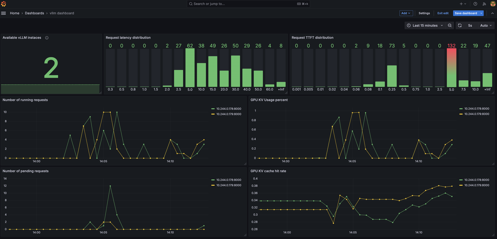

.. _observability:

Observability Models
====================

The current ``production-stack`` uses a combination of Prometheus and Grafana to provide observability for the stack.

Deploy the observability stack
------------------------------

The stack is based on `kube-prom-stack <https://github.com/prometheus-community/helm-charts/blob/main/charts/kube-prometheus-stack/README.md>`_.

To launch the observability stack you need

    * A running Kubernetes (K8s) environment with GPUs
    * Please follow the steps in the :ref:`examples` section.

After that you can run:

.. code-block:: bash

    cd production-stack/observability
    sudo bash install.sh

After installing, the dashboard can be accessed through the service ``service/kube-prom-stack-grafana`` in the ``monitoring`` namespace.

Access the Grafana & Prometheus dashboard
-----------------------------------------

To access the Grafana dashboard, you need to port-forward the Grafana service to your local machine.

Forward the Grafana dashboard port to the local node-port

.. code-block:: bash

    sudo kubectl --namespace monitoring port-forward svc/kube-prom-stack-grafana 3000:80 --address 0.0.0.0

Forward the Prometheus dashboard

.. code-block:: bash

    sudo kubectl --namespace monitoring port-forward prometheus-kube-prom-stack-kube-prome-prometheus-0 9090:9090

Open the webpage at ``http://<IP of your node>:3000`` to access the Grafana web page. The default user name is admin and the password can be configured in ``values.yaml`` (default is ``prom-operator``).

Import the dashboard using the ``vllm-dashboard.json`` in this folder.

Use Prometheus Adapter to export vLLM metrics
---------------------------------------------

The vLLM router can export metrics to Prometheus using the `Prometheus Adapter <https://github.com/prometheus-community/helm-charts/tree/main/charts/prometheus-adapter>`_. When running the ``install.sh script``, the Prometheus Adapter will be installed and configured to export the vLLM metrics.

We provide a minimal example of how to use the Prometheus Adapter to export vLLM metrics. See `prom-adapter.yaml <https://github.com/vllm-project/production-stack/blob/main/observability/prom-adapter.yaml>`_ for more details.

The exported metrics can be used for different purposes, such as horizontal scaling of the vLLM deployments.

To verify the metrics are being exported, you can use the following command:

.. code-block:: bash

    kubectl get --raw /apis/custom.metrics.k8s.io/v1beta1/namespaces/default/metrics | jq | grep vllm_num_requests_waiting -C 10

You should see the following output:

.. code-block:: bash

    {
      "name": "namespaces/vllm_num_requests_waiting",
      "singularName": "",
      "namespaced": false,
      "kind": "MetricValueList",
      "verbs": [
        "get"
      ]
    }

The following command will show the current value of the metric:

.. code-block:: bash

   kubectl get --raw /apis/custom.metrics.k8s.io/v1beta1/namespaces/default/metrics/vllm_num_requests_waiting | jq

You should see the following output:

.. code-block:: bash

    {
        "kind": "MetricValueList",
        "apiVersion": "custom.metrics.k8s.io/v1beta1",
        "metadata": {},
        "items": [
            {
            "describedObject": {
                "kind": "Namespace",
                "name": "default",
                "apiVersion": "/v1"
            },
            "metricName": "vllm_num_requests_waiting",
            "timestamp": "2025-03-02T01:56:01Z",
            "value": "0",
            "selector": null
            }
        ]
    }

Uninstall the observability stack
---------------------------------

To uninstall the observability stack, you can run:

.. code-block:: bash

    cd production-stack/observability
    sudo bash uninstall.sh
