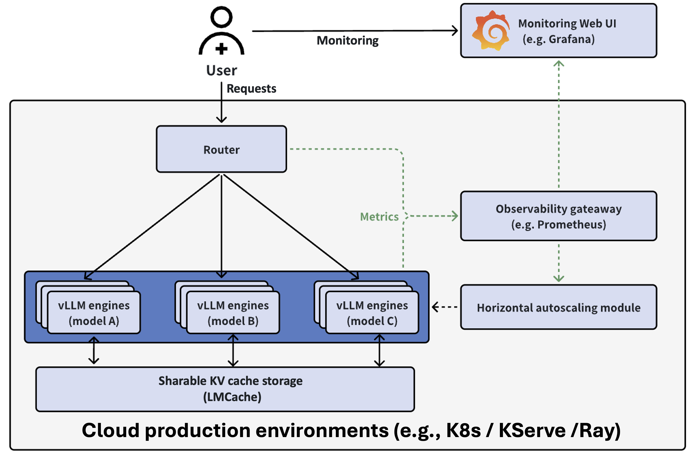

.. _installation:

.. role:: raw-html(raw)
    :format: html

Installation
============

Architecture
------------

The stack is set up using Helm, and contains the following key parts:

    * **Serving engine**: The vLLM engines that run different LLMs
    * **Request router**: Directs requests to appropriate backends based on routing keys or session IDs to maximize KV cache reuse.
    * **Observability stack**: monitors the metrics of the backends through `Prometheus <https://prometheus.io/>`_ and `Grafana <https://grafana.com/>`_.

Prerequisites
-------------

- A running Kubernetes (K8s) environment with GPUs
- Run ``cd utils`` && ``bash install-minikube-cluster.sh``
- Or follow our `tutorial <https://github.com/vllm-project/production-stack/blob/main/tutorials/00-install-kubernetes-env.md>`_

Deployment
----------

vLLM Production Stack can be deployed via helm charts. Clone the repo to local and execute the following commands for a minimal deployment:

.. code:: bash

    git clone https://github.com/vllm-project/production-stack.git
    cd production-stack/
    helm repo add vllm https://vllm-project.github.io/production-stack
    helm install vllm vllm/vllm-stack -f tutorials/assets/values-01-minimal-example.yaml

The deployed stack provides the same `OpenAI API interface <https://docs.vllm.ai/en/latest/serving/openai_compatible_server.html?ref=blog.mozilla.ai#openai-compatible-server>`_ as vLLM, and can be accessed through kubernetes service.

To validate the installation and and send query to the stack, refer to this `example <https://github.com/vllm-project/production-stack/blob/main/tutorials/01-minimal-helm-installation.md>`_.

Uninstallation
--------------

To uninstall the stack, run:

.. code:: bash

    sudo helm uninstall vllm
