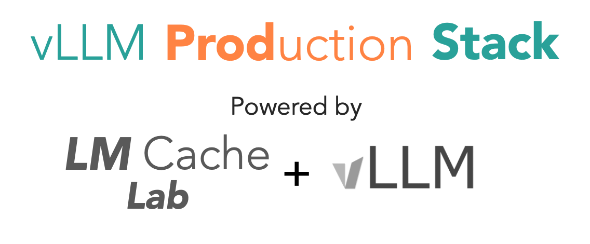

.. production-stack documentation master file, created by
   sphinx-quickstart on Mon Mar  3 12:36:28 2025.
   You can adapt this file completely to your liking, but it should at least
   contain the root `toctree` directive.

.. role:: raw-html(raw)
    :format: html

Welcome to production-stack!
==================================

.. raw:: html

   

   <strong> K8S-native cluster-wide deployment for vLLM.
   </strong>
   

.. raw:: html

   

   
   <a class="github-button" href="https://github.com/vllm-project/production-stack" data-show-count="true" data-size="large" aria-label="Star">Star</a>
   <a class="github-button" href="https://github.com/vllm-project/production-stack/subscription" data-icon="octicon-eye" data-size="large" aria-label="Watch">Watch</a>
   <a class="github-button" href="https://github.com/vllm-project/production-stack/fork" data-show-count="true" data-icon="octicon-repo-forked" data-size="large" aria-label="Fork">Fork</a>
   

**vLLM Production Stack** project provides a reference implementation on how to build an inference stack on top of vLLM, which allows you to:

- 🚀 Scale from single vLLM instance to distributed vLLM deployment without changing any application code
- 💻 Monitor the  through a web dashboard
- 😄 Enjoy the performance benefits brought by request routing and KV cache offloading
- 📈 Easily deploy the stack on AWS, GCP, or any other cloud provider

Documentation
==============================

.. Add your content using ``reStructuredText`` syntax. See the
.. `reStructuredText <https://www.sphinx-doc.org/en/master/usage/restructuredtext/index.html>`_
.. documentation for details.

.. toctree::
   :maxdepth: 1
   :caption: Getting Started

   getting_started/installation
   getting_started/examples
   getting_started/troubleshooting

.. toctree::
   :maxdepth: 1
   :caption: Deployment

   deployment/helm
   deployment/cloud-deployment/index.rst
   deployment/ray/ray.rst

.. toctree::
   :maxdepth: 1
   :caption: User Manual

   user_manual/router/index.rst
   user_manual/lora/index.rst
   user_manual/kv_cache/index.rst

.. toctree::
   :maxdepth: 1
   :caption: Developer Guide

   dev_guide/peripheral/index.rst
   dev_guide/dev_api/index.rst

.. toctree::
   :maxdepth: 1
   :caption: Tutorials

   tutorials/index.rst

.. toctree::
   :maxdepth: 1
   :caption: Benchmarks

   benchmarks/multiround-qa
