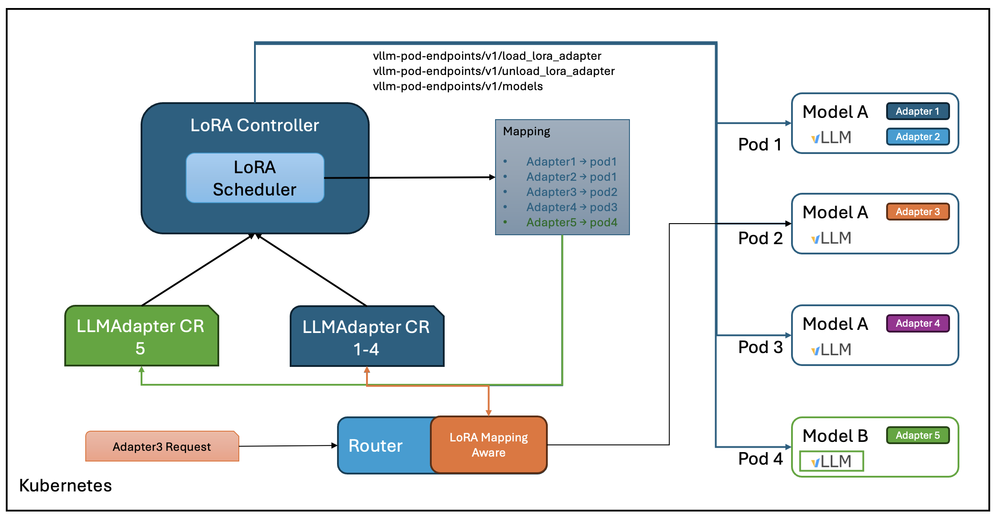

# LoRA Adapter Management for vLLM Production Stack on Kubernetes

## Table of Contents

- [Summary](#summary)
- [Motivation](#motivation)
- [Proposal](#proposal)
- [Drawbacks](#drawbacks)
- [Alternatives](#alternatives)
- [Implementation Timeline / Phases](#implementation-timeline--phases)
- [References](#references)

## Summary

This proposal introduces a Kubernetes-native system for managing LoRA (Low-Rank Adaptation) adapters in production stack vLLM deployments. The system enables efficient discovery, registration, and scheduling of adapters to appropriate vLLM pods through a custom resource definition (CRD) called `LoraAdapter`. It provides a unified, declarative approach to adapter management with support for multiple adapter sources (HuggingFace, S3, local volumes), smart scheduling based on pod constraints, and dynamic registration for runtime-efficient inference.

## Motivation

Modern LLM deployments often use numerous LoRA adapters to specialize the base model for different tasks. However, managing these adapters at scale presents several challenges:

- Manually managing adapter deployment is error-prone and doesn't scale
- Adapters often need to be distributed across multiple vLLM pods based on available resources
- Different adapters may be required for different base models
- Adapters may come from different sources (HuggingFace, S3, local storage)
- Runtime registration and deregistration of adapters requires coordination

### Goals

- Create a Kubernetes-native way to declare and manage LoRA adapters
- Support multiple adapter sources (HuggingFace, S3, local storage)
- Enable pattern-based or explicit listing of adapters for discovery
- Implement smart scheduling of adapters across vLLM pods based on resource constraints
- Provide runtime adapter registration and deregistration
- Support dynamic routing decisions based on adapter availability
- Maintain status information for adapters (loaded, failed, etc.)

### Non-Goals

- Modifying vLLM's core LoRA implementation
- Creating new LoRA adapters or training infrastructure
- Handling general LLM model provisioning (focusing only on adapters)
- Implementing a general-purpose router (only providing adapter information to existing routers)
- Supporting non-vLLM LLM services

## Proposal

### Proposed Changes

We propose a Kubernetes operator system with the following components:

1. **LoraAdapter CRD**: A custom resource definition to declare adapter sources, selection criteria, and deployment configurations.

2. **LoRA Controller**: A control plane component that:
   - Watches for LoraAdapter CRs
   - Discovers adapters from sources
   - Determines optimal adapter placement
   - Updates adapter status

3. **Lora-Scheduler**: A set of scheduling algorithms that determines which adapters should be loaded on which vLLM pods based on:
   - Pod resource constraints (memory, storage)
   - Base model compatibility
   - Adapter priority and usage patterns

4. **vLLM Integration**: Modifications to the vLLM Production Stack Helm chart to:
   - Support LoRA enablement per model
   - Provide proper labels and annotations for discovery
   - Add volume mounts for adapter storage

5. **Router Integration**: An API for routers to query adapter availability across pods for intelligent routing decisions.

### Implementation Details/Notes/Constraints

#### Architecture / Components



The LoRA Controller architecture illustrates the interaction between various components:

- The LoRA Controller watches for LoraAdapter CRs and manages the lifecycle of adapters
- When a new LoraAdapter is created, the controller:
  1. Discovers adapters from the specified source (HuggingFace, S3, or local storage)
  2. Uses the Lora-Scheduler library to determine optimal pod placement
  3. Coordinates with vLLM pods to load/unload adapters
  4. Updates the adapter status in the CR
- The controller performs periodic reconciliation to:
  1. Verify CR status matches actual pod adapter registrations via v1/models API
  2. Reconcile status if mismatches are found and pods still exist
  3. Update CR status to reflect current state
- The controller responds to vLLM pod events:
  - When pods are deleted or added, triggers rescheduling via Lora-Scheduler
  - Updates CR status to reflect new adapter-to-pod mappings
- The Router API allows external components to query adapter availability and make routing decisions
- vLLM pods are labeled for discovery and configured with appropriate storage for adapters

The system architecture consists of:

- **Control Plane**:
  - LoRA Controller Deployment (cluster-wide singleton)
  - Kubernetes CRDs (LoraAdapter)

- **Data Plane**:
  - vLLM Pod integration
  - Adapter storage volumes
  - Pod labeling for discovery

#### Custom Resources

The primary custom resource is the `LoraAdapter` with the following structure:

```yaml
apiVersion: production-stack.vllm-project/v1alpha1
kind: LoraAdapter
metadata:
  name: example-adapter
spec:
  baseModel: "meta-llama/Llama-2-70b-hf"
  adapterSource:
    type: "huggingface"  # or "s3" or "local"
    repository: "org/repo"
    pattern: "*alpaca*"  # Optional: pattern matching
    adapters: []         # Optional: explicit list
    prefix: "lora-"      # Optional: prefix matching
  credentialsSecretRef:
    name: "source-credentials"
  deploymentConfig:
    loadOnStartup: true
    podSelector:
      matchLabels:
        lora-enabled: "true"
        baseModel: "meta-llama-Llama-2-70b-hf"
  schedulingConfig:
    priority: 10
    preemptionPolicy: "LowerPriority"  # or "None"
    resourceRequirements:
      memory: "2Gi"
status:
  phase: "Ready"  # or "Loading", "Failed", "Partial"
  loadedAdapters:
    - "alpaca-lora-7b"
  failedAdapters:
    - name: "alpaca-lora-13b"
      reason: "Not enough memory"
  podAssignments:
    - pod: "vllm-llama-0"
      adapters: ["alpaca-lora-7b"]
```

#### Interface Changes

1. **vLLM Deployment Template**:
   - Add `loraConfig.enabled` flag per model
   - Add labels for controller discovery
   - Add volume mounts for adapter storage

2. **Lora-Scheduler API**:
   - `ScheduleAdapter(adapter, availablePods)` - Determine which pods should load which adapters
   - `GetAdapterStatus(adapter)` - Get the current status of an adapter
   - `GetPodAdapters(pod)` - Get the adapters assigned to a pod

3. **Router Integration API**:
   - `ListAvailableAdapters(baseModel)` - List adapters available for a base model
   - `GetPodsForAdapter(adapterName)` - Get pods that have a specific adapter loaded

#### Performance Considerations

- **Memory Usage**: LoRA adapters require additional memory in vLLM pods, which the scheduler must account for
- **Initialization Time**: Loading adapters takes time, which may impact pod readiness
- **Controller Overhead**: Minimal, as it primarily watches and updates CRs

#### Resource Constraints

- **vLLM Pod Memory**: Each LoRA adapter requires memory proportional to its size and the base model
- **Storage**: Adapters need to be stored, either in memory, local volumes, or shared storage
- **Controller Resources**: Minimal (100-500m CPU, 256-512Mi memory)

### Test plans

#### Unit Tests

- Controller logic for adapter discovery
- Scheduler algorithms for adapter placement
- Status update operations
- Adapter source access (HuggingFace, S3, local)

#### Integration/E2E Tests

- End-to-end adapter discovery and loading
- Multiple adapter sources
- Pod labeling and discovery
- Adapter scheduling across multiple pods
- Controller resilience (restarts, API failures)

#### Negative Tests

- Invalid adapter specifications
- Missing credentials
- Network failures during adapter download
- Resource exhaustion scenarios
- Conflicting adapter definitions

## Drawbacks

- **Increased Complexity**: Adds another component to the Kubernetes deployment
- **Resource Overhead**: Additional storage and memory required for the controller
- **Failure Modes**: New potential points of failure in the control plane
- **Learning Curve**: Operators need to learn new CRDs and concepts

## Alternatives

### Manual Adapter Management

- **Approach**: Manually configure each vLLM pod with the adapters it should load
- **Pros**: Simpler, no additional components
- **Cons**: Doesn't scale, error-prone, no dynamic adapter management

### Do Nothing

- If we do nothing, users would need to manually manage adapters through vLLM's existing mechanisms
- This would become increasingly difficult as the number of adapters and pods grows
- Would limit the ability to do dynamic adapter management and intelligent routing

## Implementation Timeline / Phases

### Phase 1: Core Infrastructure (Month 1)

- Implement LoraAdapter CRD
- Create basic controller with adapter discovery
- Add vLLM deployment template modifications

### Phase 2: Scheduler and Status (Month 2)

- Implement basic lora-scheduler algorithms
- Add status tracking and updates
- Integrate with vLLM for adapter loading

### Phase 3: Advanced Features (Month 3)

- Implement advanced scheduling algorithms
- Add router integration API
- Support preemption and priority

### Phase 4: Production Readiness (Month 4)

- Full test coverage
- Documentation
- Performance optimization

## References

- [vLLM LoRA Support](https://docs.vllm.ai/en/latest/quantization/lora.html)
- [Kubernetes Custom Resource Definitions](https://kubernetes.io/docs/concepts/extend-kubernetes/api-extension/custom-resources/)
- [Low-Rank Adaptation (LoRA) Paper](https://arxiv.org/abs/2106.09685)
- [Operator Pattern in Kubernetes](https://kubernetes.io/docs/concepts/extend-kubernetes/operator/)
